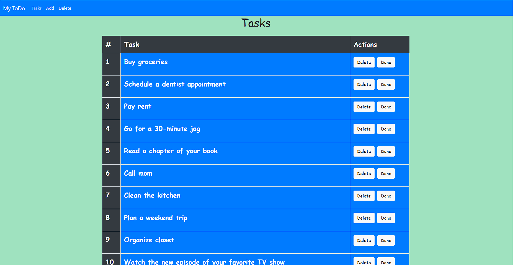
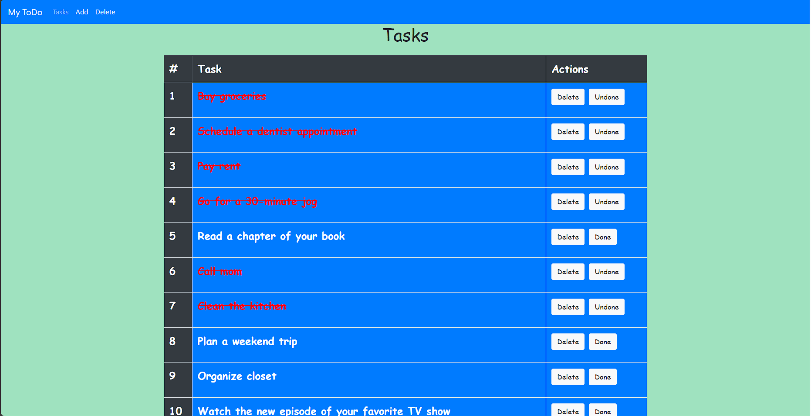
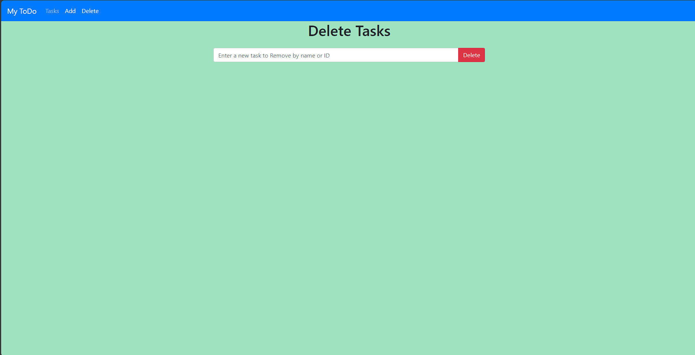
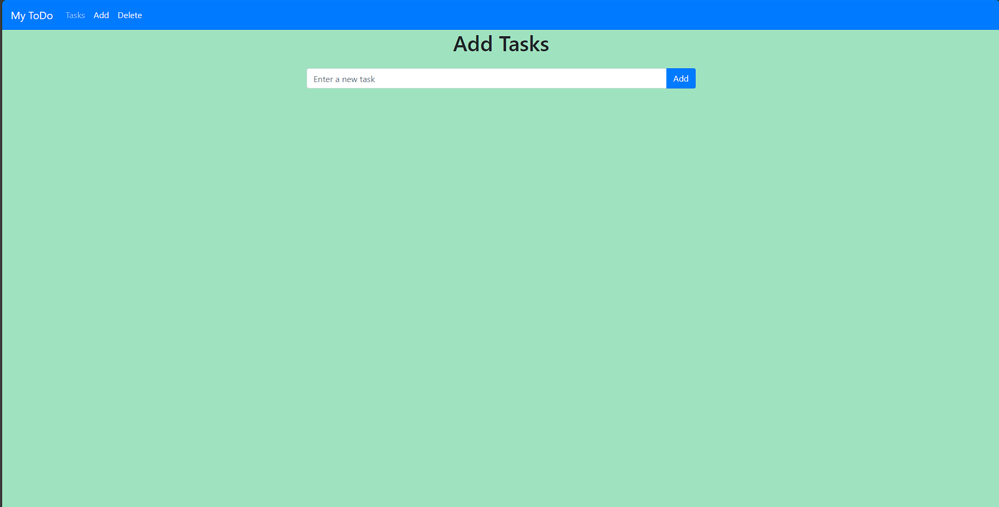
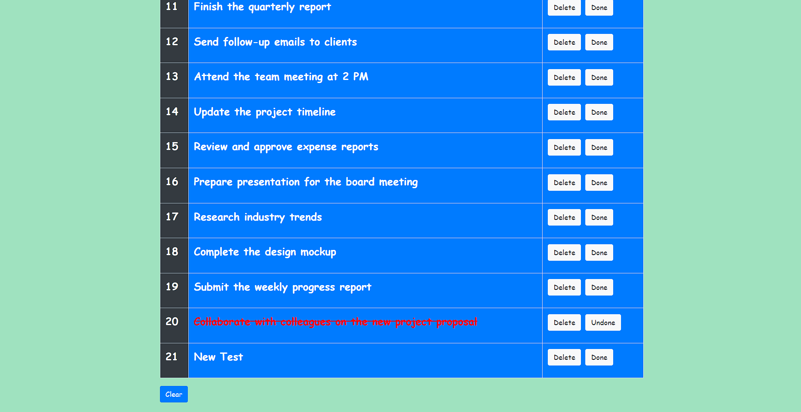

```markdown
# Django To-Do List Application





## Description
This is a simple To-Do List application built with Django and SQLite. It allows users to add, view, and delete tasks.

## Features
- Add new tasks
- View all tasks
- Delete tasks

## Installation
1. Clone this repository: `git clone <repository-url>`
2. Navigate to the project directory: `cd <project-directory>`
3. Install the required packages: `pip install -r requirements.txt`
4. Run the server: `python manage.py runserver`

## Usage
- To add a task, navigate to the 'Add Task' page, enter your task in the input field, and click 'Add'.
- To view all tasks, navigate to the 'Tasks' page.
- To delete a task, click the 'Delete' button next to the task you want to delete on the 'Tasks' page.

## Contributing
Pull requests are welcome. For major changes

## License
[MIT](https://choosealicense.com/licenses/mit/)
```

Please replace `<repository-url>` and `<project-directory>` with your actual repository URL and project directory name. Also, you might need to adjust the installation and usage instructions based on your actual application setup and functionality.
